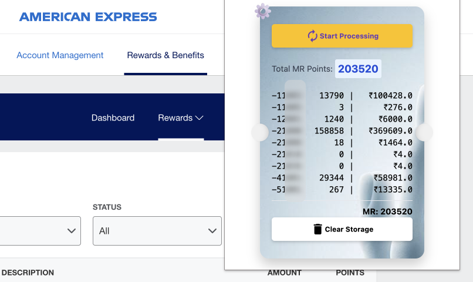

# Amex Lifetime Rewards Tracker Extension
This Chrome extension automates the process of tracking total lifetime rewards earned on American Express (Amex) credit cards along with corresponding expenses. It extracts the data from the Amex summary page and stores it locally in the browser.

## Features
- **Automation:** The extension automatically navigates through each card and compiles reward points data along with corresponding expenses.
- **Persistent Data:** The data is stored locally in the browser for easy access and tracking.
- **Updates:** The extension displays live updates of the total rewards and expenses as it processes each card.
- **Accessibility:** The extension provides a user-friendly approach to track your rewards and expenses over time.

## Demo

## How to Use
1. Install the extension in Chrome.
2. Log into your American Express account and navigate to the /summary page.
3. Click on the extension icon in your toolbar.
4. Once the pop-up appears, click on the 'Run' button to start processing.
5. The extension will start navigating each card and begin compiling the lifetime rewards and expenses.
6. Data will be displayed as it is extracted. You can monitor the process as it happens.
7. Click on 'Clear Storage' button if you wish to delete the stored data.
8. Please note that the extension works on a 2-second delay between each action to allow page elements to load properly.

## Future Enhancements (TODO)
- Extend functionality to include points from closed cards.
- Further optimize page navigation and data extraction process.
## Disclaimer
This extension is intended for personal use only. By using this extension, you acknowledge that you are using it at your own risk. We hold no responsibility for any issues or damage that may occur. Always ensure you are following Amex's policies and terms of use.